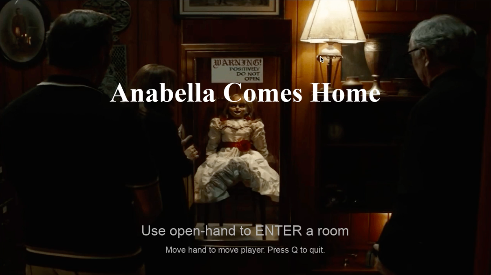
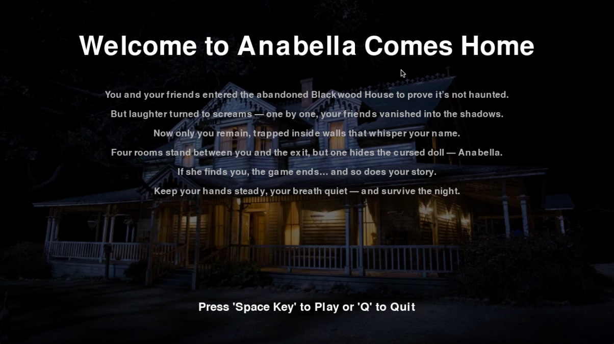
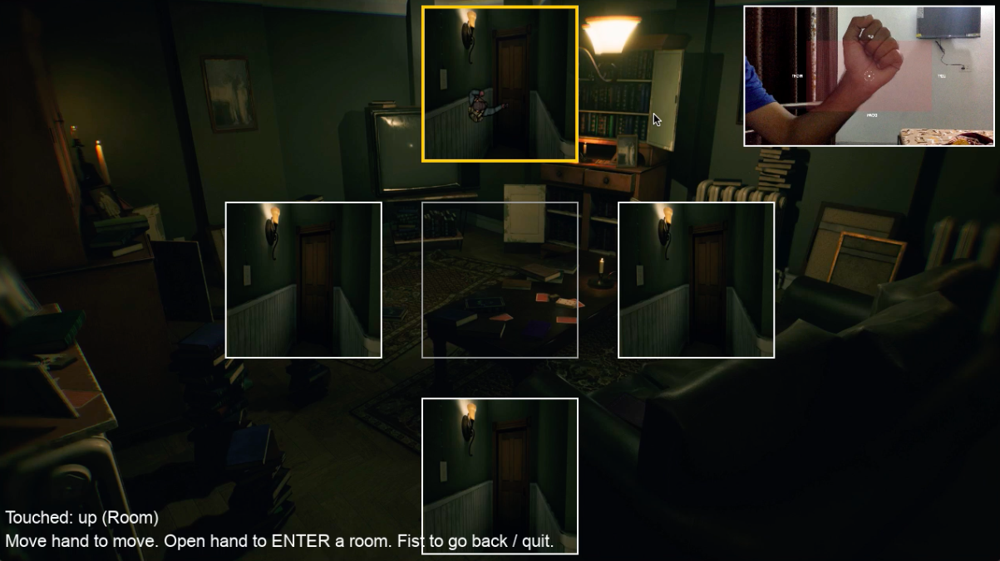
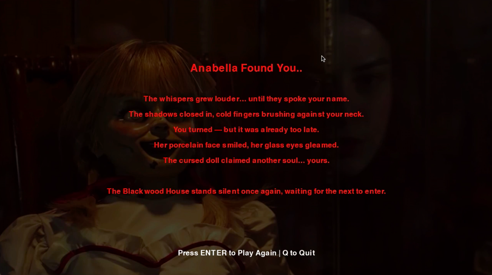
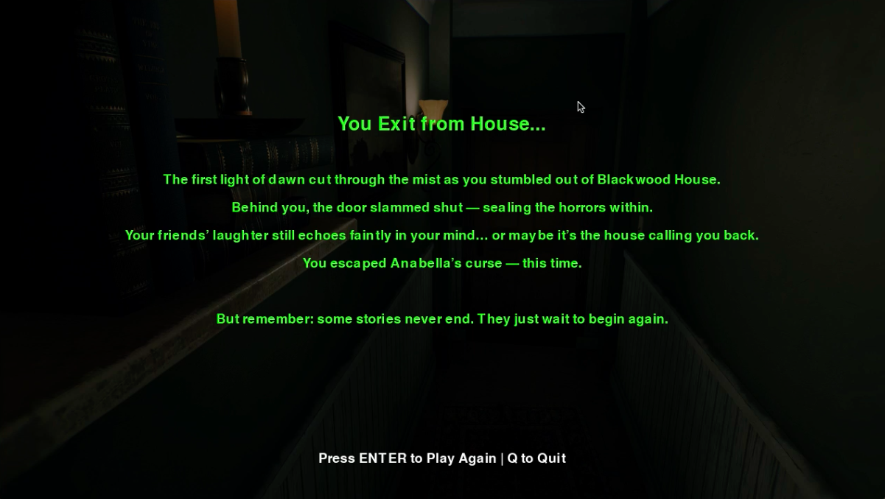
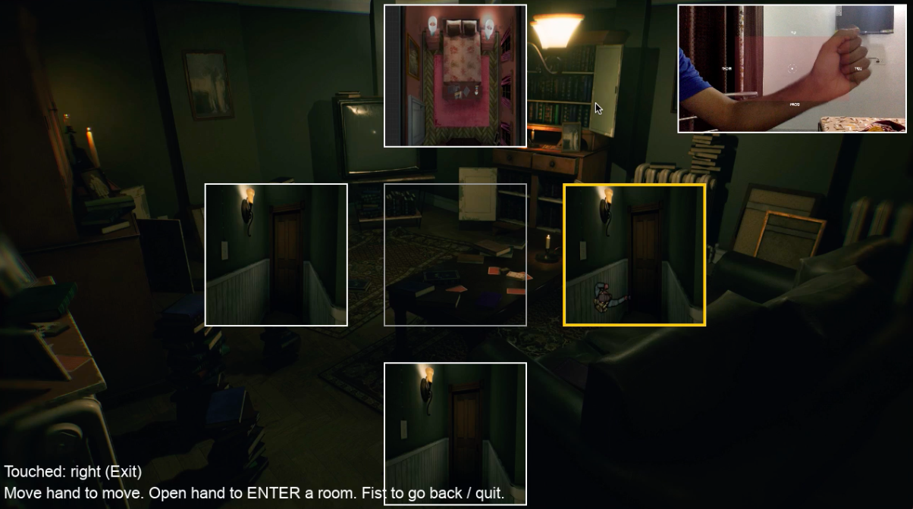

# 🕯️ Annabelle Comes Home

**Annabelle Comes Home** is an immersive horror game built with **Python**, **Pygame**, **OpenCV**, and **MediaPipe**.  
You don’t use a keyboard or mouse — instead, you control the game entirely through **hand gestures captured by your webcam**.

Your goal: Survive the haunted **Blackwood House** and escape before the cursed doll **Anabella** finds you.

---

## 🏚️ Story

You and your friends dared to enter the abandoned **Blackwood House** to prove it wasn’t haunted.  
But laughter turned to screams — one by one, your friends vanished into the shadows.  
Now, only **you** remain.

> Four rooms stand between you and freedom.  
> One hides the cursed doll, **Annabelle**.  
> If she finds you… the game ends.

Keep your hands steady. Move quietly. Survive the night.

---

## 🕹️ Gameplay Controls

| Action | Control |
|--------|----------|
| **Move Player** | Move your **hand** in front of the webcam |
| **Enter Room** | Show an **open hand** |
| **Go Back** | Make a **closed fist** |
| **Quit Game** | Press **Q** |
| **Skip / Continue** | Press **ENTER** or **SPACE** |

> Tip: The game uses real-time **hand tracking** via your webcam. Keep your hand clearly visible in front of the camera.

---

## 📸 Screenshots

| Welcome Screen | Intro Story | Gameplay |
|----------------|-------------|-----------|
|  |  |  |

| Anabella Room | Exit Room | More Gameplay |
|----------------|------------|----------------|
|  |  |  |

---

## ⚙️ Installation

Clone this repository and install the required dependencies.

```bash
git clone https://github.com/hunjanhar/Annabelle-Comes-Home.git

cd Annabelle-Comes-Home

pip install -r requirements.txt
```

## ▶️ How to Run the Game

- After installing dependencies, simply run:

```bash
python main.py
```

- The game will start with the Welcome Screen.
- Make sure your webcam is connected and working.

## 🎮 Gameplay Overview

### Welcome Screen

- Open your hand or press ENTER to start.

- Press Q to quit.

### Intro Video & Story

- Watch the cinematic or press SPACE to skip.

### Exploration

- Move your hand to move the player.

- Open your hand to enter a room.

- Make a fist to go back.

### Endings

- Find Anabella’s room → You lose.

- Find the Exit room → You survive.

## 🧠 Features

- 👋 Hand Tracking Gameplay — Control using real gestures

- 🎥 Cinematic Intro Video — Movie-like immersion

- 🔊 Atmospheric Soundtrack — Real horror ambience

- 🕯️ Multiple Endings — “Anabella Found You” or “You Escaped”

- 🧩 Dynamic Room System — Randomized room textures and outcomes

## 🧰 Technologies Used

| Library             | Purpose                           |
| ------------------- | --------------------------------- |
| **Pygame**          | Game rendering, audio, and events |
| **OpenCV**          | Webcam input and frame processing |
| **MediaPipe Hands** | Real-time gesture recognition     |
| **MoviePy**         | Video playback and audio sync     |

## 📜 License

This project is licensed under the MIT License — you are free to use, modify, and distribute it with attribution.
